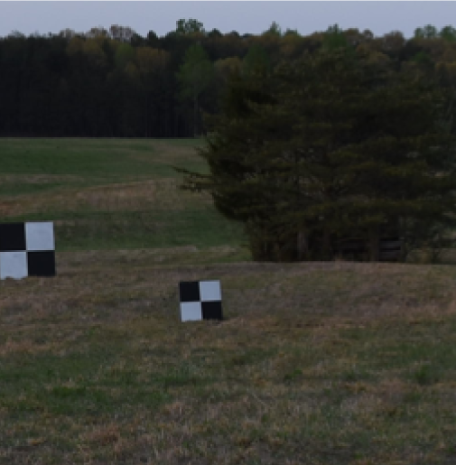
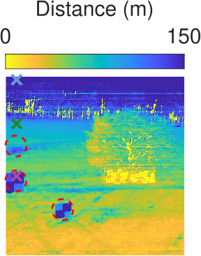
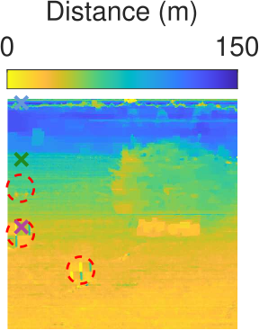
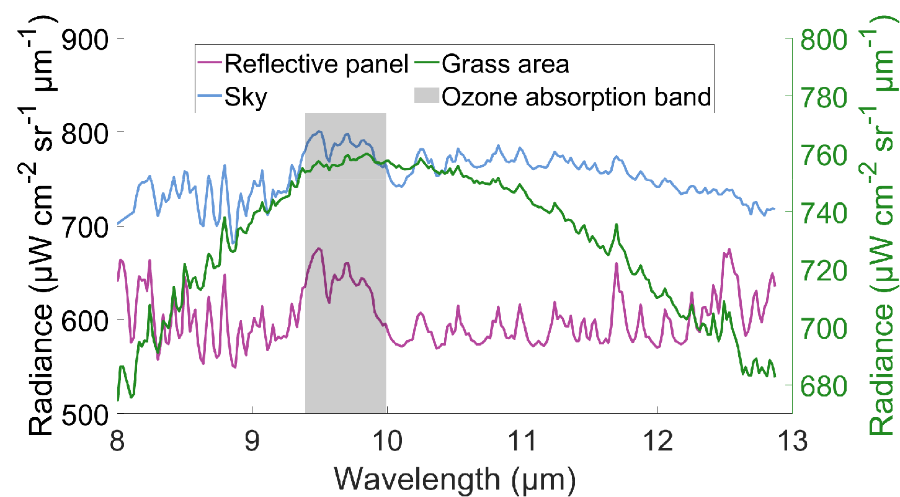

# Ozone Cues Mitigate Reflected Downwelling Radiance in LWIR Absorption-Based Ranging
Passive long-wave infrared (LWIR) absorption-based ranging estimates object distance by exploiting wavelength-dependent atmospheric absorption in emitted thermal radiation. Unlike active depth sensing, this approach operates day and night without external illumination and does not rely on scene texture.
In natural scenes with low temperature contrast, however, reflected thermal radiation—particularly downwelling radiance from the sky—can significantly distort absorption features and lead to large range overestimation, especially for reflective materials.

This paper identifies reflected downwelling radiance as a primary source of error in absorption-based ranging and introduces a principled way to mitigate its effects using ozone absorption cues.
While most LWIR absorption features arise from water vapor and affect both ground-level propagation and downwelling radiance, the ozone absorption band near 9.5 µm provides a distinctive spectral signature that is unique to downwelling radiance.
This enables separation of emitted and reflected components in the observed radiance.

We propose two new ranging methods that exploit this insight. The quadspectral method uses four narrow spectral bands—two near water vapor absorption and two near ozone absorption—to obtain a simple closed-form range estimate with minimal computation.
The hyperspectral method leverages a broader spectral range to improve robustness under low temperature contrast while jointly estimating range, object temperature, emissivity profiles, and reflected downwelling contributions.

Experimental results on real LWIR data demonstrate substantial improvements in ranging accuracy. In challenging scenes where neglecting reflected downwelling radiance leads to large range overestimation, the proposed methods significantly reduce error, with the hyperspectral approach achieving meter-level accuracy.

  
  
  

  <em>
  Left: RGB photograph (reference only).  
  Middle: Absorption-based ranging when downwelling radiance is neglected
  (reflective surfaces are overestimated).  
  Right: Ranging results when reflected downwelling radiance is accounted for.
  </em>

  

  <em>
  Spectral measurements at a reflective panel, grass area, and sky pixel.
  The ozone absorption band provides a distinctive cue for identifying
  reflected downwelling radiance.
  </em>

## Dataset

The hyperspectral datacubes are publicly available at **DARPA Invisible Headlights Dataset** [Yellin et al., 2024](https://registry.opendata.aws/darpa-invisible-headlights/).
The attenuation, downwelling radiance dictionary are provided in `data/` folder for an example scene (Path 5 Step 1).

## Usage

### 1. Hyperspectral Estimation (Python)

`hyperspectral_estimation.py` generates hyperspectral absorption-based ranging results. It supports two modes:

- **Without downwelling correction:** reproduces the method from [U. Dorken Gallastegi et al., IEEE TPAMI, 2025](https://ieeexplore.ieee.org/abstract/document/10877411).
- **With downwelling correction:** implements the new ozone-based method that corrects for reflected downwelling radiance.

### 2. Bispectral / Quadspectral Estimation (Matlab)

The MATLAB code `bispectral_estimation.m` and `quadspectral_estimation.m` in `matlab/Functions` folder implements bispectral and quadspectral absorption-based ranging methods:

- **Bispectral:** uses two narrow spectral bands (near water vapor absorption) to compute a simplified range estimate without downwelling correction ([U. Dorken Gallastegi et al., IEEE TPAMI, 2025](https://ieeexplore.ieee.org/abstract/document/10877411)).
- **Quadspectral:** uses four narrow spectral bands (two near water vapor absorption and two near ozone absorption) to compute a closed-form range estimate that accounts for reflected downwelling radiance.

The scripts in the `matlab/` folder can also be used to regenerate the figures presented in the manuscript.  

## Citation

If you use this repository, please cite:

U. Dorken Gallastegi, W. Shangguan, V. Choudhary, A. Agarwal, H. Rueda-Chacón, M. J. Stevens, and V. K. Goyal,
"Ozone Cues Mitigate Reflected Downwelling Radiance in LWIR Absorption-Based Ranging,"
IEEE Transactions on Computational Imaging, vol. 12, pp. 587–600, 2026.
https://doi.org/10.1109/TCI.2026.3668998

@ARTICLE{11417700,
  author={{Dorken Gallastegi}, Unay and Shangguan, Wentao and Choudhary, Vaibhav and Agarwal, Akshay and Rueda-Chacón, Hoover and Stevens, Martin J. and Goyal, Vivek K},
  journal={IEEE Transactions on Computational Imaging},
  title={Ozone Cues Mitigate Reflected Downwelling Radiance in LWIR Absorption-Based Ranging},
  year={2026},
  volume={12},
  pages={587-600},
  doi={10.1109/TCI.2026.3668998}
}
